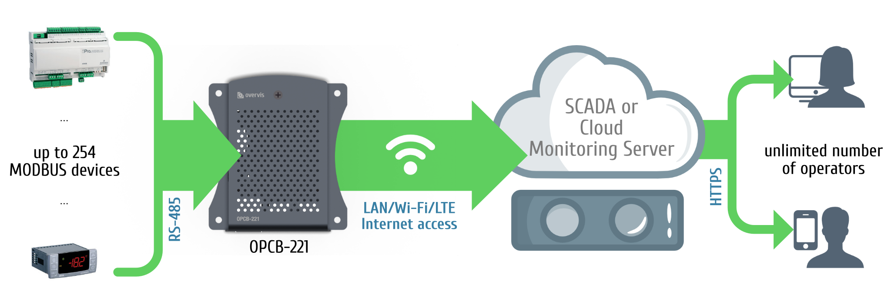
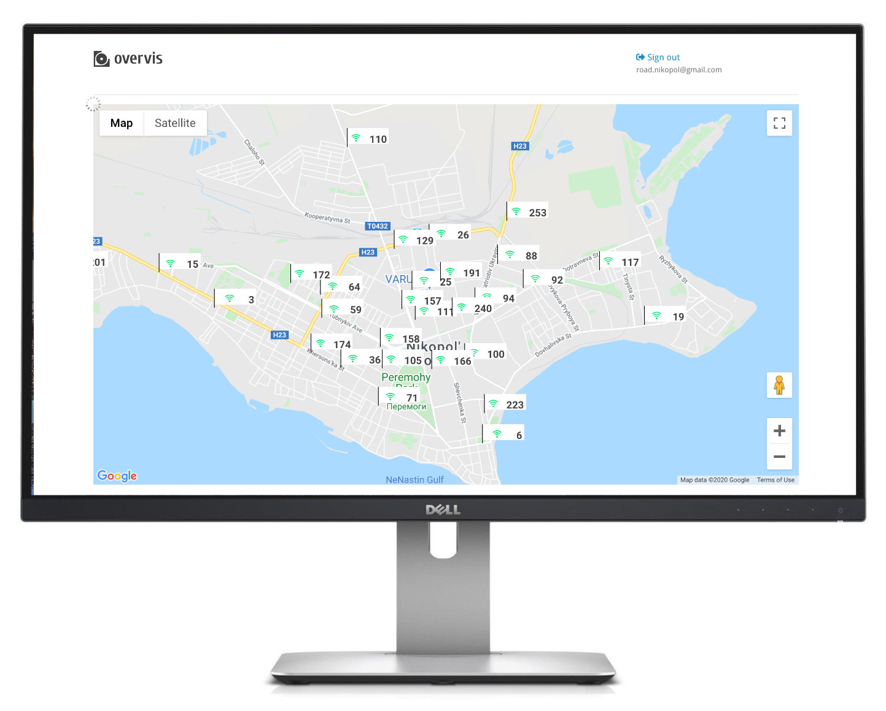

# OPCB Runtime

OPCB is a device that functions as MODBUS RTU <> MODBUS TCP converter. It connects the industrial
equipment (RS-485) to the internet (TCP/IP).


OPCB is used to connect:

- Refrigeration controllers;
- HVAC systems controllers;
- Agricultural smart devices;
- Power network relays, meters, and other electrical equipment;
- Industrial IoT devices;
- Industrial sensors and meters;
- Any other MODBUS-compatible electronics.



OPCB can be acquired as a product from [www.overvis.com](https://www.overvis.com/) or manufactured
by anyone using any single-board computer. This set of files automatically installs OPCB runtime
and is tested with:

- [Orange Pi PC Plus](https://www.orangepi.com/index.php?route=product/product&product_id=866) with
  [Armbian Jammy 23.5](https://www.armbian.com/orange-pi-pc-plus/).

OPCB can be used as a stand-alone device, but its main goal is to be compatible with the
[Overvis monitoring system.](https://www.overvis.com/) In conjunction with Overvis it provides:

**Data collection:**

- Gather operational data points (any numeric values) from your equipment.
- Store history of operational data, get insights and analytics.
- Collected data is fully exportable (Excel, CSV).
- Hazard Analysis Critical Control Point (HACCP) reporting.

**SMS and email notifications:**

- Configure alarms for operational parameters thresholds or connection errors.
- Set up a “chain of responsibility” requiring alarm confirmations from personnel and escalating
  them in the absence of response.
- All alarm actions are logged and ready for review.

**Real-time monitoring and control:**

- Create dashboards with real-time information received from the equipment.
- Visualize the data using open SVG format.
- Use Google Maps API to display objects’ locations.
- Use JavaScript and Overvis API to set up quick action controls for operation personnel.

**And more:**

- Use templates to quickly create devices and alarms.
- Manage access levels for different accounts inside one organization.
- Works with dynamic IPs and bypasses firewalls.
- Optimized mobile access.
- Industry-standard encryption.
- Overvis API allows the automation of control and can be used to load data into other management
  systems.



## Feature list

- MODBUS RTU/TCP converter.
- Built-in Overvis cloud support (www.overvis.com).
- Serving as TCP server or client, MODBUS RTU master or slave.
- RS-485 network extension.
- MODBUS ASCII mode support.
- Supporting LAN and/or Wi-Fi connection.
- Optional 3G/LTE connection using an external USB modem.
- Wi-Fi Access Point mode.
- Web-interface, accessible from the local network or via WiFi Access Point.
- Remote configuration (using MODBUS or web-interface).
- RS-485 network settings: baud rate, parity, response timeout.
- Multiple RS-485 networks support.
- MODBUS request debugging tools.
- Automatic or manual firmware update.
- HTTP API.

## Installation

### Hardware requirements

Required hardware:

- Single board computer.
  [Orange Pi PC Plus](https://www.orangepi.com/index.php?route=product/product&product_id=866) is
  recommended for now.
- Micro SD card, 4GB or more.
- High-quality 2.5A micro USB power supply
- Any USB<>RS485 converter (e.g.,
  <https://www.amazon.com/Industrial-USB-RS485-Converter-Communication/dp/B081MB6PN2>)

Optional hardware:

- _If LAN connection is required:_ RJ45 (Ethernet) cable.
- _If the mobile network connection is required:_ 3G/LTE USB modem with a local carrier SIM card.
- _For debugging console in case of network connection issues:_ USB-RS232TTL 3.3V CH340 with pin
  connection cords (e.g., <https://robotdyn.com/usb-serial-adapter-ch340g-5v-3-3v.html>)
- Plastic case.

_TODO: hardware connection schematic_

### Installing the OPCB runtime

1. Boot the single board computer from the SD card with a fresh OS installation.
2. Login to single board computer
   [remotely using SSH](https://www.raspberrypi.com/documentation/computers/remote-access.html#introduction-to-remote-access)
   or using the debugging console with USB-RS232TTL. Make sure that the computer has the access to
   the internet.
3. Run the following Bash command:

```bash
sudo git clone --branch opcb --single-branch https://github.com/overvis/opcb-release.git /opcb && sudo /opcb/install.sh
```

Enter the password if requested.

After this command completes, OPCB services should be installed and running. Device's Wi-Fi will be
switched to Access Point mode with the name `OPCB_XXXXXX` where XXXXXX is the last characters of
the device's MAC address. By connecting to this Wi-Fi (without password) user can access OPCB
web-interface by using the address: http://setup.overvis.com/ or http://192.168.4.1/

_TODO: web interface screenshot._

### Connecting to RS-485 MODBUS equipment

Connect your equipment to the USB<>RS485 converter and insert it into the single board computer
with the OPCB services running. Consult your equipment manual for RS-485 connection.

_TODO: expand this section with examples, debugging howtos and the supported equipment list._

### Connecting OPCB to Overvis monitoring system

_TODO_

## Maintenance

### Runtime details

OPCB runtime is installed as a systemd service `opcb`. Start, stop or restart this service as
needed.

### Checking the system journal

To check the OPCB runtime log use this command:

```bash
journalctl -u opcb
```

Log level can be changed in the OPCB configuration in the file `runner-config.json`.

### Versioning

OPCB follows [semantic versioning.](https://semver.org/) Each version is tagged in this repository
with a tag in the format `OPCB/A.B.C`

The current version of the OPCB services is displayed on the bottom of the configuration web
interface page or can be accessed through the API.

## User documentation

See [OPCB User Documentation.](./docs/OPCB/README.md)

## Contributing

Please use GitHub issues to report any errors or ask questions. We plan to release the OPCB source
code as soon as it is documented.

## License (Apache)

See [LICENSE](./LICENSE)
