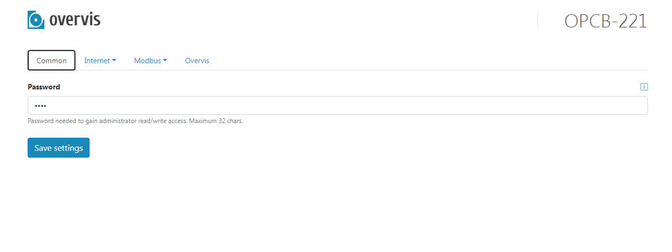

## ПРИЛОЖЕНИЕ A. Подключение к Wi-Fi. Первоначальная настройка

### Первоначальная нстройка

Ненастроенное изделие после включения и инициализации создает точку доступа
`OPCB_XXXXXX` (где XXXXXX - последние 6 знаков адреса MAC на наклейке изделия).
Для настройки следует подключиться к этой точке доступа с паролем `12345678`,
затем в браузере ввести адрес `setup.overvis.com` (или `192.168.4.1`).

Откроется страница настройки, как показано на рисунке.

Выбирая нужные закладки и подразделы в них, следует настроить OPCB-221.

_Если устройство должно работать через облачный сервер, то необходимо настроить
на зкладках `Network` один или несколько сетевых интерфейсов, через которые
OPCB-221 может получить доступ к Интернет. Затем на закладке `Overvis` при
необходимости настроить адрес облачного сервера. После правильной настройки
параметров для выхода в Интернет, сохранения настроек и перезапуска изделия,
будет установлена связь с облачным сервером. Дальнейшую настройку можно
производить через облачный сервер._

После окончания настройки сохранить параметры кнопкой `Save settings`.

Затем на закладке `Actions` нажать кнопку `Restart device` для перезапуска
OPCB-221 и применения настроек.
