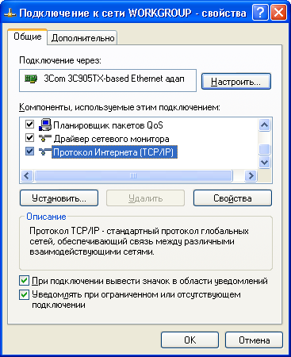

## ПРИЛОЖЕНИЕ B. Подключение к Ethernet

**ВНИМАНИЕ! Подключение изделия к сети Ethernet требует взаимного согласования
настроек подключенных устройств. Подключение к сети неправильно настроенного
устройства может повлиять на связь, в том числе других устройств в сети. Как
правило, все подключения к сети, объединяющей более 2-х устройств, проводятся
квалифицированным персоналом (сетевым администратором).**

### IP-адресация

При связи устройств по сети Ethernet по протоколу TCP/IP, для определения
отправителя и получателя данных каждое устройство использует набор настроек
IP-адресации. Устройство хранит в памяти собственный, уникальный в пределах
одной подсети IP-адрес (четыре байта, записывается в виде четырех целых чисел в
диапазоне 0-255, разделенных точками), маску подсети, одинаковую для всех
устройств в подсети (записывается аналогично IP-адресу) и IP-адрес шлюза,
который используется для связи с другими сетями. Для правильной связи устройств
в подсети необходимо выполнение нескольких условий:

1. Маска одинакова для всех устройств в одной подсети. Как правило, в небольших
   локальных сетях используется маска 255.255.255.0.
2. Маска начинается с группы бит, установленных в 1, за которой следует группа
   бит, сброшенных в 0.
3. Во всех IP-адресах устройств в одной подсети биты, которые в маске
   установлены в 1, одинаковы, и представляют адрес подсети. Для маски
   255.255.255.0 в локальных сетях наиболее часто используются адреса,
   начинающиеся со 192.168 . Третий байт может быть использован как номер
   подсети в сложной локальной сети. В небольших сетях третий байт, как правило,
   равен 0.
4. Набор бит в IP-адресах устройств, которые в маске сброшены в 0, уникален для
   каждого устройства в пределах одной подсети.
5. В большинстве случаев в сеть включается устройство (например, роутер),
   имеющее связь с другими сетями. Часто для него резервируются адреса
   192.168.0.1, или 192.168.0.100, или 192.168.0.101. В таком случае другим
   устройствам в сети указывается IP-адрес этого устройства в качестве адреса
   шлюза. Указание этого адреса необязательно для связи устройств в подсети
   между собой, и используется только для связи устройства в одной подсети с
   устройствами в других сетях.

При заводских настройках OPCB-221, для связи с ним устройство-клиент (и любые
другие устройства в той же подсети) должно использовать адрес OPCB-221, выданный
роутером локальной сети по DHCP. Если подключение производится в сети с DHCP,
или требуется установить фиксированый адрес OPCB-221 для доступа к нему, то во
избежание конфликтов адресации рекомендуется временно отключить настраиваемое
устройство от сети, чтобы установить связь этого устройства с OPCB-221 напрямую.
Это позволит настраивать устройство и OPCB-221 для дальнейшей работы в сети.

### Настройка устройства-клиента

Настройка адресации устройства производится в соответствии с документацией к
этому устройству и к программному обеспечению, использующемуся на нем.

Ниже приведен пример настройки персонального компьютера (ПК) под управлением
операционной системы (ОС) Windows XP или Windows 7 для связи напрямую с
OPCB-221, имеющим заводские настройки.

Для настройки сетевого адреса в операционной системе (ОС) Windows следует
открыть список сетевых подключений ОС. Для этого, в зависимости от версии ОС,
выполнить действия, перечисленные ниже.

Для ОС Windows 10/7:

1. Зайти в ОС под учетной записью администратора.
2. Выбрать «Пуск->Панель управления».
3. Если пункты панели управления разделены на категории, выбрать категорию «Сеть
   и Интернет».
4. Открыть пункт «Центр управления сетями и общим доступом».
5. В списке задач (на панели слева) выбрать «Изменение параметров адаптера».

Для ОС Windows XP:

1. Зайти в ОС под учетной записью администратора.
2. Выбрать «Пуск->Панель управления».
3. Если пункты панели управления разделены на категории, выбрать категорию «Сеть
   и подключения к Интернету».
4. Открыть пункт «Сетевые подключения».

Далее выполнить следующие действия:

1. В открывшемся окне подключений выбрать нужное подключение через адаптер,
   адресацию которого необходимо изменить. Многие компьютеры имеют только один
   адаптер и одно подключение, которое будет отображаться в данном окне. Если в
   окне показано несколько подключений, выбрать нужное подключение, используя
   название адаптера в подписи подключения, или обратиться к системному
   администратору.
2. Щелкнуть по значку выбранного подключения правой кнопкой, выбрать в
   выпадающем меню пункт «Свойства». Откроется окно свойств, пример окна показан
   на рисунке В.1.

3. В открывшемся окне, в списке компонентов подключения выбрать «Протокол
   Интернета (TCP/IP)». Убедиться, что компонент включен (помечен флажком в
   списке). Нажать кнопку «Свойства». Откроется окно свойств TCP/IP, пример окна
   показан на рисунке В.2.

4. Выбрать опцию «Использовать следующий IP-адрес».
5. В поле «IP-адрес» указать адрес в диапазоне 192.168.0.1–192.168.0.255 (кроме
   192.168.0.111, который будет используется прибором OPCB-221).
6. В поле «Маска подсети» указать «255.255.255.0».
7. Поля «Основной шлюз», «Предпочитаемый DNS-сервер», «Альтернативный
   DNS-сервер» оставить пустыми.
8. Нажать «ОК» для закрытия окна настройки протокола.
9. Нажать «ОК» для закрытия окна настройки подключения.
10. Если при закрытии окон, при применении параметров ОС предложит перезагрузить
    компьютер, ответить утвердительно.

### Подключение к Internet

**ВНИМАНИЕ! Настоятельно рекомендуется подключение изделия к сети Интернет
проводить под наблюдением системного администратора локальной сети и/или
представителя провайдера услуг Интернет.**

Для подключения к Интернет используйте следующие рекомендации:

- у провайдера услуг Интернет (далее провайдер) следует получить выделенную
  линию (при необходимости доступа к изделию снаружи из Интернет, следует также
  заказать услугу статического IP-адреса; для подключения изделия к облачному
  серверу статический адрес не требуется);
- использовать сетевой маршрутизатор или роутер для поддержания связи с
  провайдером и создания локальной сети, к которой будет подключено изделие; при
  этом кабель провайдера подключается к разъему роутера `Uplink` (обычно
  выделенному цветом и не имеющему номера, в зависимости от производителя
  роутера обозначение может отличаться, например, "WAN" или `Internet` - см.
  документацию к роутеру). Для подключения изделия к роутеру применяется кабель
  Ethernet Straight-through (входит в комплект). Пользуясь документацией к
  роутеру, следует настроить роутер для подключения к Internet в соответствии с
  рекомендациями провайдера. Также, при необходимости доступа к изделию снаружи
  из Интернет без помощи облачного сервера, в настройках роутера следует
  включить перенаправление приходящих (на предоставленный провайдером
  статический IP-адрес) запросов на IP-адрес OPCB-221 (в этом случае адрес
  изделия следует зафиксировать либо в настройках роутера, либо в настройках
  OPCB-221);
- следует убедиться, что подключение изделия к Интернет будет защищено
  стандартными средствами (см. ниже);
- при обращении к изделию в сети Интернет следует использовать IP-адрес,
  предоставленный провайдером.

### Защита подключения

- OPCB-221 имеет базовые средства защиты от несанкционированного доступа по сети
  ;
- настройки прибора могут быть изменены удаленно только после ввода пароля (не
  менее 5 знаков). Повторение неправильных паролей с целью подбора правильного
  значения блокируется изделием;
- при вводе пароля настройки становятся доступны только для данного клиента по
  данному протоколу. При долгом отсутствии запросов от клиента подключение
  закрывается. **Примечание – при правильно введенном пароле режим настройки
  через Modbus открывается в незащищенном соединении. При необходимости смены
  настроек по сети (особенно в сетях, безопасность которых не обеспечивается
  иными средствами) настоятельно рекомендуется настраивать изделие при помощи
  браузера через Web-интерфейс или через облачный сервер;**
- встроенные средства защиты доступа не предназначены против злоумышленных
  сетевых атак (особенно атак, цель которых – не доступ к изделию, а
  блокирование доступа);
- в сложных и разветвленных сетях (особенно при обеспечении доступа к OPCB-221
  по Интернет) рекомендуется отделять изделие от небезопасных сетей стандартными
  средствами защиты (роутер, настроенный для фильтрации передач, Firewall и т.
  п.).
