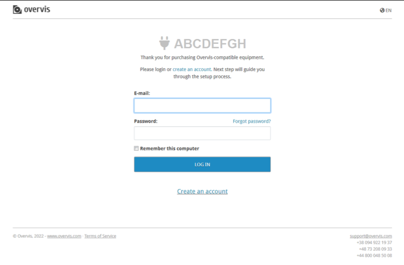

## ПРИЛОЖЕНИЕ E. Работа под управлением облачного сервера

### Подключение к облачному серверу

Для доступа к OPCB-221 через облачный сервер следует перейти по ссылке на
наклейке изделия (или по QR-коду на наклейке). Если вход в учетную запись
Overvis не был выполнен, откроется страница входа. Если запись отсутствует, то
необходимо зарегистрировать новую на этой странице. Пример страницы показан на
рисунке.

После входа откроется страница добавления новой сети (шлюзом доступа к которой
выступает OPCB-221) с полями, заполненными для связи с изделием. Пример страницы
показан на рисунке.

Следует указать имя сети с изделием в поле "Name". При необходимости, можно
добавить подключенные к OPCB-221 устройства Modbus в список "Connected devices",
либо сделать это позднее. Затем следует нажать кнопку "Install" для добавления
сети с изделием к учетной записи.
