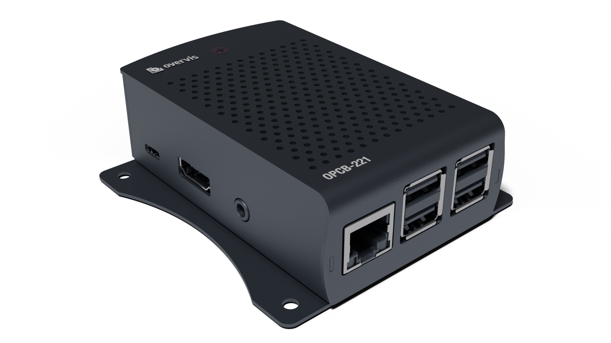

# Контроллер OPCB-221. Руководство по эксплуатации. Паспорт

**ВНИМАНИЕ! ВСЕ ТРЕБОВАНИЯ РУКОВОДСТВА ПО ЭКСПЛУАТАЦИИ ОБЯЗАТЕЛЬНЫ ДЛЯ
ВЫПОЛНЕНИЯ!**

**ДЛЯ ОБЕСПЕЧЕНИЯ БЕЗОПАСНОЙ ЭКСПЛУАТАЦИИ ИЗДЕЛИЯ КАТЕГОРИЧЕСКИ ЗАПРЕЩАЕТСЯ:**

- **ВЫПОЛНЯТЬ МОНТАЖНЫЕ РАБОТЫ И ТЕХНИЧЕСКОЕ ОБСЛУЖИВАНИЕ БЕЗ ОТКЛЮЧЕНИЯ
  ИЗДЕЛИЯ ОТ ПИТАНИЯ;**
- **САМОСТОЯТЕЛЬНО ОТКРЫВАТЬ И РЕМОНТИРОВАТЬ ИЗДЕЛИЕ;**
- **ЭКСПЛУАТИРОВАТЬ ИЗДЕЛИЕ С МЕХАНИЧЕСКИМИ ПОВРЕЖДЕНИЯМИ КОРПУСА.**

**НЕ ДОПУСКАЕТСЯ ПОПАДАНИЕ ВОДЫ НА КЛЕММЫ И ВНУТРЕННИЕ ЭЛЕМЕНТЫ ИЗДЕЛИЯ.**

**При эксплуатации и техническом обслуживании необходимо соблюдать требования
нормативных документов:**

- **«Правила технической эксплуатации электроустановок потребителей»,**
- **«Правила техники безопасности при эксплуатации электроустановок
  потребителей»,**
- **«Охрана труда при эксплуатации электроустановок».**

**Подключение, регулировка и техническое обслуживание изделия должны выполняться
квалифицированными специалистами, изучившими настоящее Руководство по
эксплуатации.**

**При соблюдении правил эксплуатации изделие безопасно для использования.**

Настоящее Руководство по эксплуатации предназначено для ознакомления с
устройством, требованиями по безопасности, порядком эксплуатации и обслуживания
контроллера OPCB-221 (далее по тексту «контроллер», «изделие», «OPCB-221»).

## Назначение

### Назначение изделия

### Габаритные и установочные размеры

1. разъем "Power" (microUSB) для подключения источника питания 5 В постоянного
   или переменного тока мощностью не менее 9 Вт;
2. разъем "Memory" для установки карты памяти;
3. разъем "Ethernet" (8P8C/RJ45) для проводного подключения к локальной сети
   Ethernet;
4. разъемы "Ext." (4 разъема USBA) для подключения дополнительных модулей
   (например, преобразователей последовательного интерфейса RS-485 / RS-232);

**Рисунок 1** – Габаритные и установочные размеры OPCB-221

### Условия эксплуатации

Изделие предназначено для эксплуатации в следующих условиях:

- температура окружающей среды от минус 10 до +55 °С;
- атмосферное давление от 84 до 106,7 кПа;
- относительная влажность воздуха (при температуре +25 °С) 30 … 80%.

**Если температура изделия после транспортирования или хранения отличается от
температуры воздуха, при которой предполагается эксплуатация, то перед
подключением к электрической сети выдержать изделие в условиях эксплуатации в
течение двух часов (т.к. на элементах изделия возможна конденсация влаги).**

**Внимание! Изделие не предназначено для эксплуатации в условиях:**

- значительной вибрации и ударов;
- высокой влажности;
- агрессивной среды с содержанием в воздухе кислот, щелочей и т.п., а также
  сильных загрязнений (жир, масло, пыль и пр.).

## КОМПЛЕКТНОСТЬ

Комплект изделия приведен в таблице 1.

**Таблица 1** – Комплект изделия

| Наименование                               | Количество (шт.) |
| ------------------------------------------ | ---------------- |
| Контроллер                                 | 1                |
| Модуль RS-485                              | 1                |
| Карта памяти (с предустановленным ПО)      | 1                |
| Блок питания 9 Вт с выходом microUSB (5 В) | 1                |
| Кабель Etherent 1,8 м                      | 1                |
| Руководство по эксплуатации. Паспорт       | 1                |
| Упаковка                                   | 1                |

## ТЕХНИЧЕСКИЕ ХАРАКТЕРИСТИКИ

Основные технические характеристики изделия приведены в таблице 2.

**Таблица 2** – Основные технические характеристики

| Наименование                                                                                                                                         |               Значение                |
| :--------------------------------------------------------------------------------------------------------------------------------------------------- | :-----------------------------------: |
| Напряжение питания постоянного тока, В                                                                                                               |                   5                   |
| Интерфейс обмена по сети Ethernet                                                                                                                    |    10BASE-T/100BASE-T (витая пара)    |
| Поддерживаемые протоколы сети Ethernet                                                                                                               |           Modbus TCP, HTTP            |
| Максимальное количество подключений по протоколу Modbus TCP                                                                                          |                   4                   |
| Встроенные сервера                                                                                                                                   |      Modbus-сервер, HTTP-сервер       |
| Дополнительные модули <ul><li>последовательный интерфейс RS-485 (до 32 устройств)</li><li>последовательный интерфейс RS-232 (1 устройство)</li></ul> |             1* –*            |
| Поддерживаемые протоколы последовательных интерфейсов                                                                                                |       Modbus RTU, Modbus ASCII        |
| Максимальное количество подключенных устройств в сети Modbus                                                                                         |                  32                   |
| Индикация                                                                                                                                            |             Светодиодная              |
| Время готовности при включении питания, мин, не более                                                                                                |                   1                   |
| Потребляемый ток, мА, не более                                                                                                                       |                 1800                  |
| Масса, кг, не более                                                                                                                                  |                 0,500                 |
| Габаритные размеры, мм, не более                                                                                                                     |             95 х 60 х 30              |
| Назначение изделия                                                                                                                                   | Аппаратура управления и распределения |
| Номинальный режим работы                                                                                                                             |            продолжительный            |
| Характеристики клемм (дополнительных модулей):<ul><li>сечение подключаемых проводов, мм2</li><li>момент затяжки винтов клемм, Н\*м</li></ul>         |          0,3 – 1 0,3         |
| Степень защиты                                                                                                                                       |                 ІР20                  |
| Класс защиты от поражения электрическим током                                                                                                        |                  II                   |
| Климатическое исполнение                                                                                                                             |                УХЛ3.1                 |
| Категория перенапряжения                                                                                                                             |                  II                   |
| Допустимая степень загрязнения                                                                                                                       |                  II                   |
| Гальваничечкая изоляция, кВ <ul><li>разъем питания</li><li>разъем Ethernet</li><li>разъем USB</li></ul>                                              |           – 1,5 –         |
| Номинальное напряжение изоляции, В                                                                                                                   |                  450                  |
| Номинальное импульсное выдерживаемое напряжение, кВ                                                                                                  |                  1,0                  |
| Установка (монтаж)                                                                                                                                   |               панельная               |
| Изделие сохраняет свою работоспособность при любом положении в пространстве                                                                          |                                       |
| Материал корпуса - самозатухающий пластик                                                                                                            |                                       |
| Вредные вещества в количестве, превышающем предельно допустимые концентрации, отсутствуют                                                            |                                       |

\* – дополнительные модули сверх комплекта поставляются под заказ

## ИСПОЛЬЗОВАНИЕ ПО НАЗНАЧЕНИЮ

### Подготовка к использованию

#### Подготовка к подключению:

- распаковать и проверить изделие на отсутствие повреждений после
  транспортировки, в случае обнаружения таковых обратиться к поставщику или
  производителю;
- внимательно изучить руководство по эксплуатации (**обратите особое внимание
  на схему подключения питания изделия**);
- если у Вас возникли вопросы по монтажу изделия, пожалуйста, обратитесь в
  отдел технической поддержки по телефону, указанному в конце Руководства по
  эксплуатации.

#### Общие указания

**ВНИМАНИЕ! ВСЕ ПОДКЛЮЧЕНИЯ ДОЛЖНЫ ВЫПОЛНЯТЬСЯ ПРИ ОБЕСТОЧЕННОМ ИЗДЕЛИИ.**

**Ошибка при выполнении монтажных работ может вывести из строя изделие и
подключенные к нему приборы.**

Для обеспечения надежности электрических соединений следует использовать гибкие
(много-проволочные) провода, концы которых необходимо зачистить от изоляции на
5±0,5 мм и обжать втулоч-ными наконечниками. Рекомендуется использовать провод
сечением не менее 0,2 мм2.

При подключении к шине RS-485 следует использовать кабель «витая пара» категории
Cat. 1 или выше. Рекомендуется использовать экранированный кабель, в этом случае
его следует заземлить.

Крепление проводов должно исключать механические повреждения, скручивание и
стирание изоляции проводов.

**НЕ ДОПУСКАЕТСЯ ОСТАВЛЯТЬ ОГОЛЕННЫЕ УЧАСТКИ ПРОВОДА, ВЫСТУПАЮЩИЕ ЗА ПРЕДЕЛЫ
КЛЕММНИКА.**

**Для надежного контакта необходимо производить затяжку винтов клеммника с
усилием, указанным в таблице 2.**

**Для повышения эксплуатационных свойств изделия рекомендуется установить
предохранитель F1 (вставку плавкую) или его аналог в цепи питания OPCB-221 на
ток 0,5 А.**

#### Подключение изделия

Подключение OPCB-221 производится по схеме, представленной на рисунке 2, в
следующем порядке:

- при помощи кабеля витых пар категории Cat.1 или выше подключить клеммник
  модуля RS-485 к шине последовательного интерфейса (или напрямую к устройству
  с данным интерфейсом); _Примечание – контакт «A» для передачи
  неинвертированного сигнала (D+), контакт «B» – для инвертированного сигнала
  (D-)._
- если изделие должно выходить в Интернет или подключаться к другим
  устройствам по проводной связи: при помощи кабеля соединения с сетью
  Ethernet (входит в комплект) подключить разъем "Ethernet" (8P8C/RJ45) к
  локальной сети. Особенности подключения в зависимости от типа сети описаны в
  приложении Б;
- утсановить карту памяти (входит в комплект) в разъем "Memory";
- подключить модуль RS-485 к одному из разъемов "Ext." (USBA) изделия;
- подключить блок питания (входит в комплект) к разъему "Power" (microUSB);
- закрепить соединения USB при помощи пластиковых хомутов (входят в комплект);
- подключить кабель соединения с источником питания (кабель с медными
  многопроволочными жилами сечением не менее 0,75 мм2 и максимальным рабочим
  напряжением не менее 380 В) к разъему «220 В», затем подключить кабель к
  сети питания 220 В 50 Гц.

**Рисунок 2** – Схема подключения изделия

### Использование OPCB-221

#### Общие сведения

После подачи питания изделие производит инициализацию (загрузку ОС, запуск
интерфейсов). Это может занять до 1 минуты. Затем OPCB-221 автоматически
подключается к облачному серверу, если подключение к Интернет было ранее
настроено. Если изделие не было настроено, оно создает точку доступа Wi-Fi, к
которой можно подключиться для настройки OPCB-221, как описано в приложении А.

32-х разрядный процессор под управлением POSIX-совместимой ОС осуществляет
маршрутизацию данных между USB-модулями расширения, например, последовательными
интерфейсами RS-485 / RS-232 (протоколы Modbus RTU/ASCII), и интерфейсами
локальных сетей Ethernet и Wi-Fi (протокол Modbus TCP), через которые даынне
могут передаваться в том числе по сети Интернет . Быстродействие, объем памяти и
использование многозадачности позволяют оперировать с высокоскоростными потоками
данных. WEB-интерфейс и возможность подключения к облачному серверу позволяют
удаленно контролировать состояние и настраивать изделие и подключенные к нему
устройства. Точка доступа Wi-Fi дает возможность сброса настроек и
первоначальной установки параметров.

**Примечание – при применении параметров изделие перезапускается, и клиентам
может понадобиться возобновление подключений.**

Изделие хранит настройки и журналы считанных данных на карте памяти.

**При отсутствии связи с изделием в течение долгого времени изделие
автоматически перезапускается.**

**Изделие является сложным устройством под управлением многозадачной ОС. При
написании ПО были приняты меры для избежания сбоев, при которых автоматический
перезапуск невозможен. Однако, в случае возникновения такого сбоя, для
продолжения работы может потребоваться ручной перезапуск (отключение и
возобновление питания).**

**Отсутствие связи с изделием после ручного перезапуска может быть следствием
ошибки в настроке. В этом случае следует настроить изделие заново (см.
приложение А).**

#### Работа OPCB-221 по протоколу HTTP(S)

OPCB-221 принимает подключения HTTP(S) через интерфейсы Ethernet или Wi-Fi.
Подключение с ПК или мобильного телефона может производиться при помощи
WEB-браузера.

Подробно подключение, настройка и использование изделия по HTTP(S) описаны в
Приложении В.

#### Работа OPCB-221 по протоколу Modbus (TCP/RTU/ASCII)

OPCB-221 ожидает подключение и принимает запросы Modbus TCP через интерфейсы
Ethernet или Wi-Fi, и передает их в формате Modbus RTU или Modbus ASCII по
последовательному интерфейсу. Также OPCB-221 может быть настроен на прием
запросов Modbus RTU или Modbus ASCII по последовательному интерфейсу и передачу
их в формате Modbus TCP на заданные адреса IP через интерфейсы Ethernet или
Wi-Fi. Подключение с ПК или телефона может быть произведено с помощью любых
программ – Modbus TCP клиентов. Версия клиента для ОС Windows доступна для
скачивания на сайте производителя
(http://novatek-electro.com/programmnoe_obespechenie.html).

Подробно подключение, настройка и использование изделия по Modbus описаны в
Приложении Г.

#### Работа OPCB-221 под управлением облачного сервера

OPCB-221 устанавливает и поддерживает подключение к облачному серверу (при
наличии доступа к Интернет через любой из интерфейсов). По умолчанию изделие
настроено на связь с сервером Overvis. Подробно подключение, настройка и
использование изделия с облачным сервером описаны в Приложении Ж.

### Настройка

Первоначальная настройка связи описана в приложениях А и В.

Настраиваемые параметры описаны в приложении Г. Параметры сохраняются в файле на
карте памяти.

Настройка прибора может осуществляться тремя способами:

- через WEB-интерфейс (см. Приложение В);
- через Modbus-интерфейс (см. Приложение Г);
- через облачный сервер (см. Приложение Д).

**ВНИМАНИЕ! ПРИ ИЗМЕНЕНИИ ПАРАМЕТРОВ ПРИБОРА МОГУТ БЫТЬ ЗАДАНЫ ЗНАЧЕНИЯ,
ЗАТРУДНЯЮЩИЕ ИЛИ БЛОКИРУЮЩИЕ ПОДКЛЮЧЕНИЕ К ПРИБОРУ ПО СЕТИ. В этом случае
параметры следует сбросить и провести начальную настройку изделия, как описано в
приложении А.**

## ТЕХНИЧЕСКОЕ ОБСЛУЖИВАНИЕ

### Меры безопасности

**ПРИ ТЕХНИЧЕСКОМ ОБСЛУЖИВАНИИ НЕОБХОДИМО ОТКЛЮЧИТЬ ИЗДЕЛИЕ И ПОДКЛЮЧЕННЫЕ К
НЕМУ УСТРОЙСТВА ОТ ПИТАНИЯ.**

- Техническое обслуживание изделия должно выполняться **квалифицированными
  специалистами**.
- Рекомендуемая периодичность технического обслуживания – **каждые шесть
  месяцев**.

### Порядок технического обслуживания

1. проверить надежность подсоединения проводов к клемминикам, при необходимости
   – зажать с усилием, указанным в таблице 2;
2. проверить надежность соединений USB, при необходимости – закрепить при помощи
   пластиковых хомутов;
3. визуально проверить целостность корпуса, в случае обнаружения трещин и сколов
   изделие снять с эксплуатации и отправить на ремонт;
4. при необходимости протереть ветошью лицевую панель и корпус изделия.

**Для чистки не используйте абразивные материалы и растворители.**

## СРОК СЛУЖБЫ И ГАРАНТИЯ ИЗГОТОВИТЕЛЯ

1. Срок службы изделия 10 лет. По истечении срока службы обратитесь к
   производителю.
2. Срок хранения – 3 года.
3. Гарантийный срок эксплуатации изделия составляет 3 года со дня продажи. В
   течение гарантийного срока эксплуатации (в случае отказа изделия)
   производитель выполняет бесплатно ремонт изделия. **ВНИМАНИЕ! ЕСЛИ ИЗДЕЛИЕ
   ЭКСПЛУАТИРОВАЛОСЬ С НАРУШЕНИЕМ ТРЕБОВАНИЙ ДАННОГО РУКОВОДСТВА ПО
   ЭКСПЛУАТАЦИИ, ПОКУПАТЕЛЬ ТЕРЯЕТ ПРАВО НА ГАРАНТИЙНОЕ ОБСЛУЖИ-ВАНИЕ.**
4. Гарантийное обслуживание производится по месту приобретения или
   производителем изделия.
5. Послегарантийное обслуживание изделия выполняется производителем по
   действующим тарифам.
6. Перед отправкой на ремонт изделие должно быть упаковано в заводскую или
   другую упаковку, исключающую механические повреждения.

**Убедительная просьба: при возврате изделия или передаче его на гарантийное
(послегарантийное) обслуживание, в поле сведений о рекламациях подробно
указывать причину возврата.**

## ТРАНСПОРТИРОВАНИЕ И ХРАНЕНИЕ

Изделие в упаковке производителя допускается транспортировать и хранить при
температуре от минус 45 до +60 °C и относительной влажности не более 80%. При
транспортировании изделия следует обеспечить защиту изделия от механических
повреждений.

## СВИДЕТЕЛЬСТВО О ПРИЕМКЕ

Изделие изготовлено и принято в соответствии с требованиями действующей
технической документации и признано годным к эксплуатации.

Начальник отдела качества

Дата изготовления

9 СВЕДЕНИЯ О РЕКЛАМАЦИЯХ

**Предприятие признательно Вам за информацию о качестве изделия и предложения по
его работе.**

По всем вопросам обращаться к производителю:

ООО “НОВАТЕК-ЭЛЕКТРО”, ул. Aдм. Лазарева, 59, г. Одесса, 65007, Украина.

тел. (048)738-00-28

тел/факс (0482) 34-36-73.

http://www.novatek-electro.com

Отдел гарантийного обслуживания: 067 557 1249

Отдел технической поддержки: 067 565 37 68

Дата продажи

VN220415

[ПРИЛОЖЕНИЕ A. Подключение к Wi-Fi. Первоначальная настройка](./App%20A-%20Wi-Fi%20Connection.md)

[ПРИЛОЖЕНИЕ B. Подключение к Ethernet](./App%20B-%20Ethernet%20Connection.md)

[ПРИЛОЖЕНИЕ C. Работа по протоколу HTTP. Web-интерфейс](./App%20C-%20Web%20Interface.md)

[ПРИЛОЖЕНИЕ D. Работа по протоколу Modbus](./App%20D-%20Modbus.md)

[ПРИЛОЖЕНИЕ E. Работа под управлением облачного сервера](./App%20E-%20Cloud%20Server.md)
