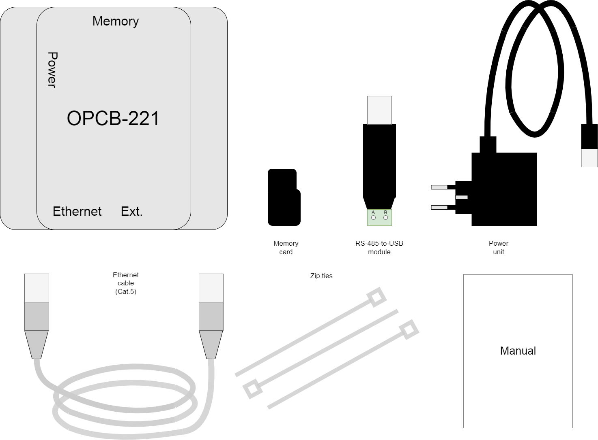
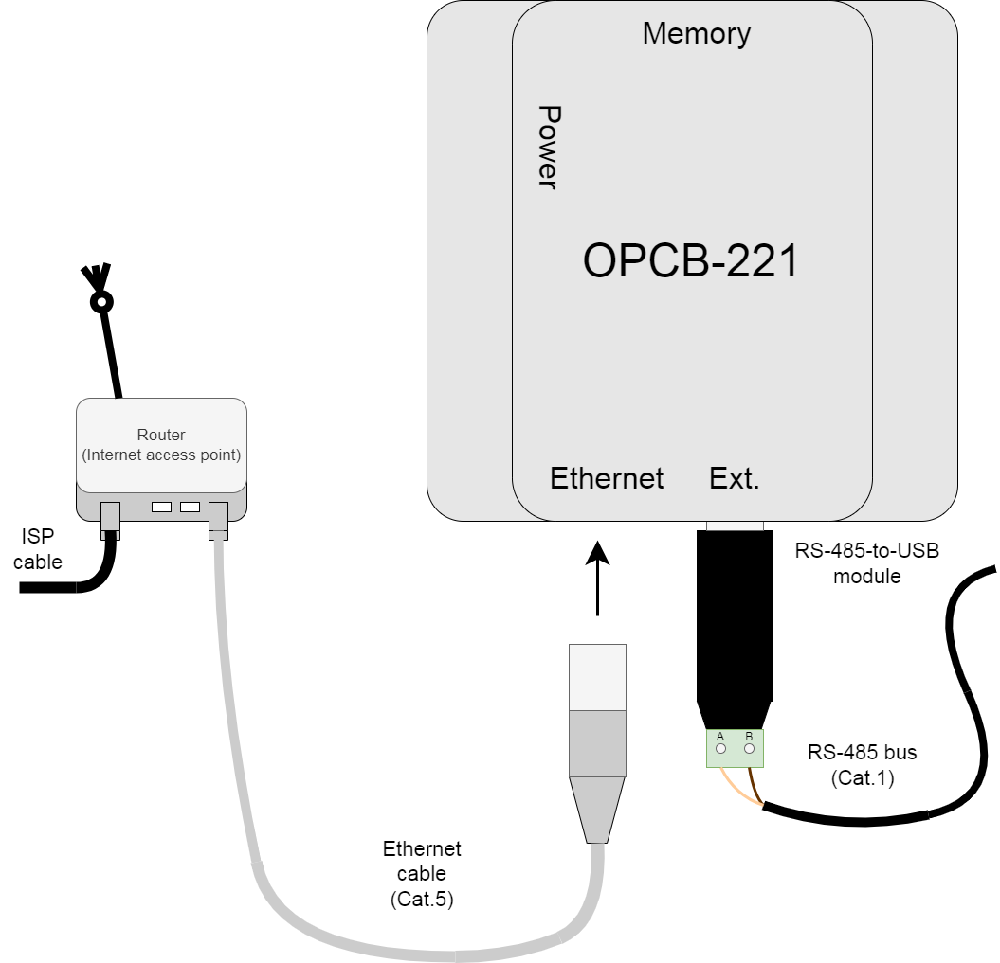
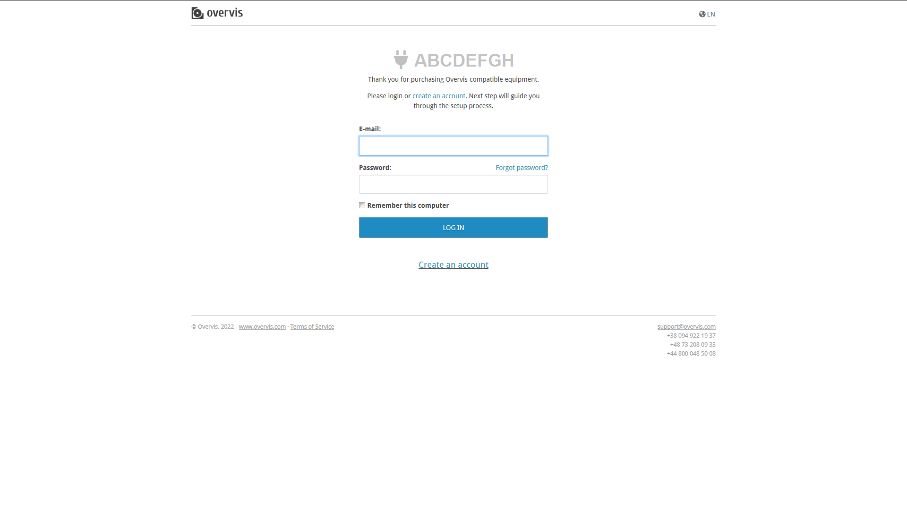

# Quick start

## Wiring the OPCB-221

1. prepare RS485 bus, LAN / Wi-Fi router connected to Internet;

2. unpack OPCB-221;

- compare OPCB-221 package contents with the manual inside, and ensure there are
  no traces of damage to any of the items;
- **compare the power unit characteristics with the local mains**;
- keep the device in the target environment for 2 hours (at least) before
  powering it;

3. Memory card is factory pre-installed into the OPCB-221 `Memory` slot;

4. connect RS-485 bus to RS485-to-USB convertor module (included);

- note the direct signal contact `A`/`A+`/`D+` and inverted signal contact
  `B`/`B-`/`D-` connection, the bus shield (if any) should be grounded at a
  single point close to the terminal;
- if the module is the last (or the first) connection on the bus line, consider
  adding a 120Ohm 0,25W termination resistor in parallel to improve performance
  for high-speed or long lines;

5. connect other Modbus controllable devices to RS-485 bus;

- the number of the devices sharing the same bus (without RS-485 repeater device
  insertion, not included) is limited by their receiver current consumption,
  usually at least 32 devices with 1mA consumption can be connected (more if
  their consumption is less than 1mA);
- each device should be added on either of the two ends of the bus (instead of
  the termination resistor), avoiding junctions and branches;
- the direct and inverted contacts should be connected accordingly, otherwise
  some or all of the bus devices would be inaccessible;
- if the bus contacts order is unknown for a custom device, it is safe to test
  it later (by trying it the both ways);
- the bus shield part between any two devices should be grounded separately
  instead of connecting it to the other shield parts;
- consider adding a 120Ohm 0,25W termination resistor in parallel to the
  terminal contacts of the uttermost device (that is, two resistors on the both
  ends of the RS-485 bus) to improve performance for high-speed or long lines;

6. connect RS-485-to-USB convertor module to OPCB-221;

- any of the OPCB-221 USB jacks marked `Ext.` can be used;
- consider fixing the module in place with the zip ties (included) to avoid
  accidental disconnection;

7. optional: if using Ethernet instead of Wi-Fi, connect OPCB-221 to the router
   with the LAN cable (included);

- do not connect to the router jack `WAN`/`Internet`, but use the conventional
  `LAN` jack instead;

8. connect power unit (included) to OPCB-221 `Power` jack;

9. connect power unit to the mains, power on OPCB-221 and other RS-485 bus
   devices.

- **ensure the mains connection is portected (with the 1A current limiter)**;

## Getting OPCB-221 to Internet

1. use your telephone or another Wi-Fi smart device to scan for access point
   `OPCB_XXXXXX` to appear (where XXXXXX are the last 6 digits in the labelled
   device MAC address, the startup can take up to 1 minute);

2. connect to the access point;

- the default password is `12345678`;

3. follow the `setup.overvis.com` link to open OPCB-221 setup page;

- if the warning page opens with misdirection explanation, try disconnecting
  your smart device from the Internet first;
- the direct address `192.168.4.1` can also be used to avoid misdirections;

4. setup OPCB-221 network interfaces to match your router configuration;

- use ELAN (Ethernet) or WLAN (Wi-Fi) interface page, or both;
- to use Wi-Fi, switch off access point mode;
- save the settings after completing each page;
- contact your local network administrator to determine the interfaces correct
  configuration;

5. optional: setup RS485 for baudrate and exchange format of the RS485 bus (this
   can be done later);

- all the bus devices should share the same baudrate and format;
- save the settings after completing each page;

6. reset OPCB-221 for the changes to take effect.

## Using Overvis to access OPCB-221

1. follow the labelled link to get to the cloud server;

- scan the labeled QR code to follow the link;
- or open the browser on your smart device, then type in the link printed on the
  label;

2. if not logged in, authorize at the cloud server;

- if password forgotten, restore your password by email with an option at the
  server login page;
- if no account yet, register a new account with an option at the server login
  page;

3. on a new Modbus network settings page, type in the new network name in the
   "Name" field;

- ensure the connection is established, and the device version is displayed at
  the top of the Modbus network settings page;

4. optional: add devices connected to the OPCB-221 (via Modbus RTU/ASCII or
   Modbus TCP) to the "Connected devices" list (this can be done later);

5. press the "Install" button;

6. finally test the connection by pressing any OPCB-221 parameter value in the
   table below;

- `...` is displayed in the values column if no value is known yet, otherwise a
  value (e.g. a number) is displayed;
- the value would then update continuously (until it is pressed again).
