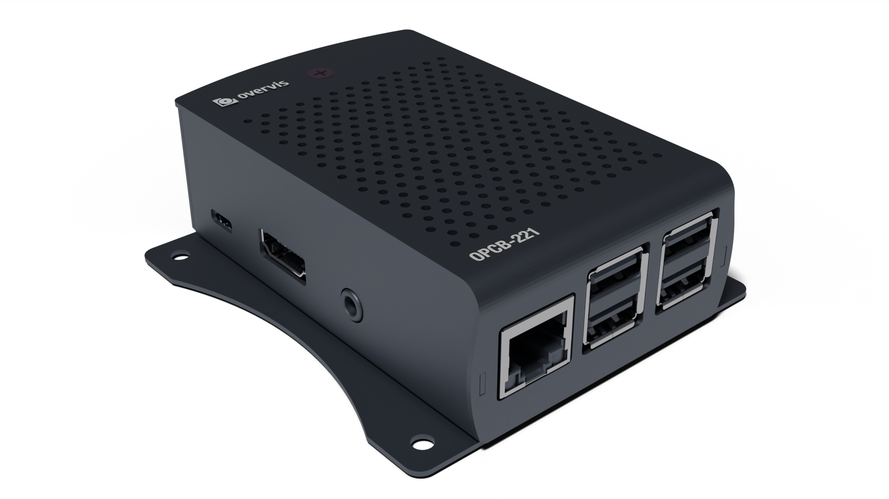

# Controller OPCB-221. Operation manual.

**ATTENTION! ALL REQUIREMENTS OF THIS OPERATION MANUAL ARE COMPULSORY TO BE
MET!**

**⚠️ TO ENSURE THE DEVICE SAFE OPERATION IT IS STRICTLY FORBIDDEN THE
FOLLOWING:**

- **TO CARRY OUT MOUNTING WORKS AND MAINTENANCE WITHOUT DISCONNECTING THE DEVICE
  FROM THE MAINS;**
- **TO OPEN AND REPAIR THE DEVICE INDEPENDENTLY**
- **TO OPERATE THE DEVICE WITH MECHANICAL DAMAGES OF THE HOUSING.**

**IT IS NOT ALLOWED WATER PENETRATION ON TERMINALS AND INTERNAL ELEMENTS OF THE
DEVICE.**

**During operation and maintenance the regulatory document requirements must be
met, namely:**

- Regulations for Operation of Consumer Electrical Installations;
- Safety Rules for Operation of Consumer Electrical Installations;
- Occupational Safety in Operation of Electrical Installations.

Installation, adjustment and maintenance of the device must be performed by the
skilled professionals having studied this Operating Manual.

The device is safe for use under keeping of the operating rules.

---

This Operating Manual is intended to familiarize you with the design, safety,
operation, and maintenance procedures of OPCB-221 controller (hereinafter
referred to as "controller", "product", "OPCB-221").

## Purpose

### Product designation

### Overall and mounting dimensions

1. "Power" connector (microUSB) for connecting a 5 V DC or AC power source with
   a power of at least 9 W;
2. "Memory" slot for inserting a memory card;
3. "Ethernet" connector (8P8C/RJ45) for wired connection to the local network
   Ethernet;
4. "Ext." connectors. (4 USBA connectors) for connecting additional modules (for
   example, RS-485 / RS-232 serial interface converters).

**Figure 1** – OPCB-221 overall and mounting dimensions

### Operating conditions

The product is designed to operate under the following conditions:

- ambient temperature from -10 to +55 °C;
- atmospheric pressure from 84 to 106.7 kPa;
- relative humidity (at +25 °С) 30 ... 80%.

**If the temperature of the product after transportation or storage differs from
the temperature of the air at which the product is to be operated then before
connecting it to the mains keep the product under the operating conditions for
for two hours before connecting it to the mains (as condensation can occur on
the product's components).**

**Attention! The product is not intended to be used in an environment:**

- significant vibration and shock;
- high humidity;
- aggressive environment containing acids, alkalis, etc., as well as strong
  contaminants (grease, oil, dust, etc.).

## COMPLETE SET

The set of the product is shown in Table 1.

**Table 1** – Product set

| Name                                        | Quantity (pcs.) |
| ------------------------------------------- | --------------- |
| Controller                                  | 1               |
| RS-485 Module                               | 1               |
| Memory card (with preinstalled software)    | 1               |
| 9 W power supply with microUSB output (5 V) | 1               |
| Etherent cable 1.8 m                        | 1               |
| Operation manual. Passport                  | 1               |
| Packaging                                   | 1               |

## TECHNICAL SPECIFICATIONS

The main technical specifications of the product are given in Table 2.

**Table 2** – Main technical specifications

| Name                                                                                                                                                               |               Value                |
| :----------------------------------------------------------------------------------------------------------------------------------------------------------------- | :--------------------------------: |
| DC power supply voltage, V                                                                                                                                         |                 5                  |
| Ethernet communication interface                                                                                                                                   | 10BASE-T/100BASE-T ((twisted pair) |
| Supported Ethernet protocols                                                                                                                                       |          Modbus TCP, HTTP          |
| Maximum number of connections via Modbus TCP protocol                                                                                                              |                 4                  |
| Built-in servers                                                                                                                                                   |     Modbus server, HTTP server     |
| Additional modules <ul><li> serial interface RS-485 (up to 32 devices)</li><li>RS-232 serial interface (1 device)</li></ul>                                        |            1* –*          |
| Supported serial interface protocols                                                                                                                               |      Modbus RTU, Modbus ASCII      |
| Maximum number of connected devices in the Modbus network                                                                                                          |                 32                 |
| Display                                                                                                                                                            |                LED                 |
| Ready time when power is turned on, min, no more                                                                                                                   |                 1                  |
| Current consumption, mA, max                                                                                                                                       |                1800                |
| Weight, kg, not more                                                                                                                                               |               0,500                |
| Overall dimensions, mm, not more                                                                                                                                   |            95 х 60 х 30            |
| Product designation                                                                                                                                                | Control and distribution equipment |
| Nominal operating mode                                                                                                                                             |             continuous             |
| Terminal Characteristics (of additional modules):<ul><li>cross-section of wires to be connected, mm2 </li><li>tightening torque of terminal screws, Н\*м</li></ul> |         0,3 – 1 0,3       |
| Degree of protection                                                                                                                                               |                ІР20                |
| Protection class against electric current                                                                                                                          |                 II                 |
| Climatic version                                                                                                                                                   |       COLD TEMPERATURES 3.1        |
| Overvoltage category                                                                                                                                               |                 II                 |
| Permissible degree of contamination                                                                                                                                |                 II                 |
| Galvanic insulation, kV<ul><li>power connector</li><li>Ethernet connector</li><li>USB connector</li></ul>                                                          |         – 1,5 –        |
| Rated insulation voltage, V                                                                                                                                        |                450                 |
| Rated impulse withstand voltage, kV                                                                                                                                |                1,0                 |
| Installation (mounting)                                                                                                                                            |               panel                |
| The product retains its performance in any position in space                                                                                                       |                                    |
| Housing material - self-extinguishing plastic                                                                                                                      |                                    |
| No hazardous substances in amounts exceeding the maximum allowable concentrations                                                                                  |                                    |

\* – additional modules are available on request

## SPECIFIED USE

### Preparation for use

#### Preparation for connection:

- unpack and inspect the product for damage after transportation and, if found,
  contact the supplier or the manufacturer;
- carefully study the operating manual (**pay special attention to the power
  connection diagram of the product**);
- if you have any questions about the installation of the product, please
  contact technical support at the phone number at the end of the operating
  manual.

#### General instructions

**ATTENTION! ALL CONNECTIONS MUST BE MADE WITH THE PRODUCT DE-ENERGIZED.**

**A mistake during installation work can damage the product and the devices
connected to it.**

To ensure the reliability of electrical connections, flexible (multi-wire) wires
should be used, the ends of which should be stripped of insulation to 5±0.5 mm
and crimped by sleeve lugs. It is recommended to use a wire cross section not
less than 0,2 mm2.

When connecting to the RS-485 bus, use twisted-pair Cat. 1 or higher. It is
recommended to use shielded cable, in which case shielded cable should be
grounded.

Fastening of wires should exclude mechanical damage, twisting and wires
insulation wiping out.

**DO NOT LEAVE ANY BARE WIRE PROTRUDING BEYOND THE TERMINAL BLOCK.**

**For reliable contact it is necessary to tighten the screws of the terminal
block with to the torque specified in Table 2.**

**To improve the performance of the product it is recommended to install F1 fuse
(fusible link) or its equivalent in the power supply circuit of OPCB-221 for 0,5
A current.**

#### Product connection

Connection of the OPCB-221 is made according to the scheme shown in Figure 2, in
the following order:

- using a twisted-pair cable of Cat.1 category or higher, connect the terminal
  block of the RS-485 module to the serial interface bus (or directly to a
  device with this interface); _Note - contact "A" for non-inverted signal (D+),
  contact "B" for inverted signal (D-)._
- if the product must access the Internet or connect to other to other devices
  via a wired connection: using the "Ethernet" connection cable (included in the
  package) connect the "Ethernet" connector (8P8C/RJ45) to the local network.
  The connection features depending on the type of network are described in
  Appendix B;
- insert the memory card (included) into the "Memory" slot;
- connect the RS-485 module to one of the "Ext connectors. (USBA) of the
  product;
- connect the power unit (included) to the "Power" (microUSB) connector;
- secure the USB connections with the plastic cable ties (included);
- connect the connection cable to the power supply (stranded copper cables with
  a cross section of at least 0.75 mm2 and a maximum operating voltage of at
  least 380 V) to the socket "220 V", then connect the cable to the power supply
  network 220 V 50 Hz.

**Figure 2** – product connection scheme

### OPCB-221 usage

#### General information

After power-up the product performs initialization (loading the operating
system, starting the interfaces). This can take up to 1 minute. Then the
OPCB-221 automatically connects to the cloud server automatically, if the
Internet connection has been previously configured. If the product has not been
configured, it creates a Wi-Fi access point, which can be connected to configure
the OPCB-221 as described in Appendix A.

A 32-bit processor running a POSIX-compliant OS routes data between USB
expansion modules, such as serial RS-485 / RS-232 interfaces (Modbus RTU/ASCII
protocols), and Ethernet and Wi-Fi local area network interfaces (Modbus TCP
protocol), through which data can be transmitted, including over the Internet.
Speed, memory size and multitasking allow to operate with high-speed data
streams. The WEB-interface and the ability to connect to a cloud server allow
you to remotely monitor the status and configure the product and devices
connected to it. The Wi-Fi hotspot allows you to reset the settings and set the
initial settings.

**Note - applying the settings will restart the product and clients may need to
reconnect.**

The product stores the settings and logs of the read data on the memory card.

**If there is no communication with the product for a long time, the product
automatically restarts.**

**The product is a complex device running a multitasking OS. Measures have been
taken when writing the software to avoid failures in which an automatic restart
is not possible. However, in the event of such a failure, a manual restart may
be required to continue operation (disconnecting and power on again.)**

**Lack of communication with the product after a manual restart may be due to a
setting error. In this case the product must be set up again (see Appendix A).**

#### OPCB-221 operation via HTTP(S) protocol

The OPCB-221 accepts HTTP(S) connections via Ethernet or Wi-Fi interfaces.
Connection from a PC or cell phone can be made using a WEB-browser.

For details on connecting, configuring, and using the product via HTTP(S), see
Appendix C.

#### OPCB-221 operation via Modbus (TCP/RTU/ASCII)

The OPCB-221 expects a connection and receives Modbus TCP requests via Ethernet
or Wi-Fi interfaces, and transmits them in Modbus RTU or Modbus ASCII format
over the serial interface. The OPCB-221 can also be configured to receive Modbus
RTU or Modbus ASCII requests via the serial interface and transmit them in
Modbus TCP format to specified IP addresses via Ethernet or Wi-Fi interfaces.
Connection from a PC or phone can be made with any software - Modbus TCP
clients. The Windows version of the client is available to download from
manufacturer's website.
(http://novatek-electro.com/programmnoe_obespechenie.html).

Connection, configuration and usage of the product via Modbus are described in
detail in Appendix D.

#### Operation of the OPCB-221 using a cloud server

The OPCB-221 establishes and maintains a connection to a cloud server (provided
that you have access to the Internet through either interface). By default, the
product is configured to communicate with the Overvis server. Connection,
configuration and usage of the product with the cloud server are described in
detail in Appendix E.

### Setting

The initial communication setup is described in Appendices A and B. The
configurable parameters are described in appendix D. The parameters will be
saved in a file on the memory card. The device can be set up in three ways:

- via the WEB-interface (see Appendix C);
- via Modbus interface (see Appendix D);
- via a cloud server (see Appendix E).

**ATTENTION! WHEN YOU CHANGE THE PARAMETERS OF THE DEVICE, YOU CAN SET VALUES
THAT MAKE IT DIFFICULT OR BLOCK THE CONNECTION TO THE DEVICE VIA THE NETWORK. In
this case you should reset the parameters and make the initial adjustment of the
product as described in the appendix A.**

## MAINTENANCE SERVICE

### Safety measures

**WHEN MAINTAINING, THE PRODUCT AND DEVICES CONNECTED TO IT MUST BE DISCONNECTED
FROM THE POWER SUPPLY.**

- Maintenance of the product should be performed by **qualified technicians**.
- The recommended maintenance interval is **every six months**.

### Maintenance procedure

1. check that the wires are securely connected to the terminals, if necessary -
   clamp with the torque specified in Table 2;
2. check the reliability of the USB connections, if necessary - fix them with
   plastic clamps;
3. visually check the integrity of the housing, in case of cracks and chips the
   product should be taken out of service and sent for repair;
4. if necessary, wipe the front panel and the body of the product with a rag.

**Do not use abrasives or solvents for cleaning.**

## SERVICE PERIOD AND MANUFACTURER'S WARRANTY

1. The service period of the product is 10 years. At the end of its service
   period, please contact the manufacturer.
2. Shelf life - 3 years.
3. The warranty period of the product is 3 years from the date of sale. During
   the warranty period (in case of product failure) the manufacturer repairs the
   product free of charge.**ATTENTION! IF THE PRODUCT HAS NOT BEEN USED IN
   ACCORDANCE WITH THE REQUIREMENTS OF THIS OPERATION MANUAL, THE BUYER WILL
   LOSE THE RIGHT TO WARRANTY SERVICE.**
4. Warranty service is performed at the place of purchase or by the
   manufacturer.
5. Post-warranty maintenance of the product is performed by the manufacturer at
   current rates.
6. Before sending the product for repair, it must be packed in the factory or
   other packaging that prevents mechanical damage.

**Please! When returning the product or submitting it for warranty
(post-warranty) service state in detail the reason for return in the complaint
information field.**

## TRANSPORTATION AND STORAGE

The product in the manufacturer's packaging may be transported and stored at
temperatures ranging from minus 45 to +60 °C and relative humidity of no more
than 80%. During transportation, the product should be protected from mechanical
damage.

## ACCEPTANCE CERTIFICATE

The product is manufactured and accepted in accordance with the requirements of
the current technical documentation and is considered suitable for operation.
Head of Quality Department Date of manufacture

COMPLAINT INFORMATION

**The company is grateful to you for information about quality of the product
and suggestions on its operation.**

If you have any questions, please contact the manufacturer: NOVATEK-ELECTRO LTD.
Ukraine, 65007,Odessa, Admirala Lazareva str. 59

tel. +38(048)738-00-28

tel/fax +38(048)234-36-73.

http://www.novatek-electro.com

Warranty Service Department: +38(067) 557-12-49

Technical Support Department: +38(067) 565-37-68

Date on sale

VN220415

[APPENDIX A. Initial setup](../Initial%20Setup/README.md)

[APPENDIX B. Ethernet Connection](../Ethernet%20Connection/README.md)

[APPENDIX C. Working with the web interface](../Web%20Interface/README.md)

[APPENDIX D. Modbus Operation Manual](../Modbus%20Operation%20Manual.md)

[APPENDIX E. Cloud Server Connection](../Cloud%20Server%20Connection/README.md)
